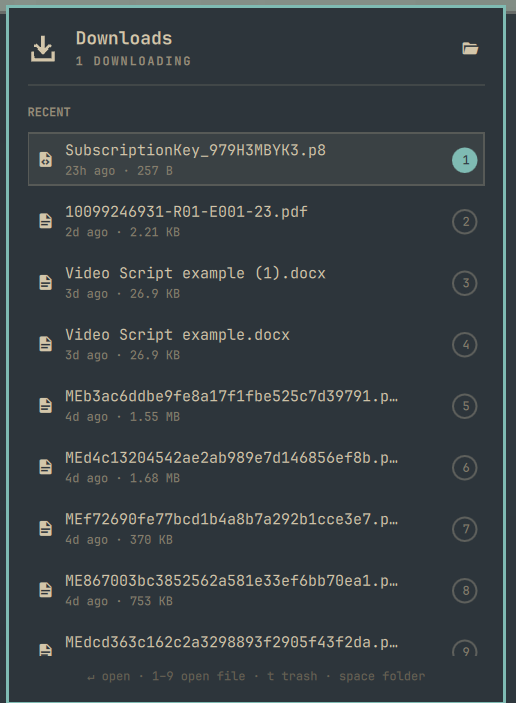

# Downloads — quick access to your Downloads folder, and one-key open

Omarchy runs beautiful chromeless web apps — which is exactly why there is no
downloads button anywhere on screen. This widget puts the downloads icon back in
your status bar. The newest file is already selected when the panel opens, so
Enter opens it; any other recent file opens by typing its number. Built for
Omarchy keyboard users.



Bind it to **SUPER + SHIFT + J**, borrowing the muscle memory from your browser,
and internalise *SUPER + SHIFT + J, Enter* — that's your latest download open.
No opening the downloads folder just to double-click one file, no file manager
tiling itself across the workspace, nothing to close afterwards.

## What it does

- **Reacts the moment a download finishes.** The watcher uses inotify, not a
  poll loop, so the bar icon drops its arrow the instant the file lands — no
  waiting for the next refresh tick.
- **Preselects the newest file.** Every other panel opens with a dormant
  cursor. This one doesn't, because there is exactly one obvious thing you came
  here to do. Keybind, Enter, done.
- **Tells the truth about in-flight downloads.** A `.crdownload` / `.part` /
  `.aria2` file is listed as *Downloading* with a live size, and a small accent
  dot sits on the bar icon for as long as anything is still being written.
- **Deletes safely.** The trash button on each row runs `gio trash`, never
  `rm` — everything it removes is recoverable from the desktop trash.
- **Numbers the first nine rows.** Each row wears a small badge; pressing that
  number opens the file immediately, with no cursor trip down the list first.
- **Opens the folder** in your file manager with `Space`, from the hero button,
  with `o`, or by right-clicking the bar icon.

## Install

```bash
omarchy plugin add https://github.com/realgbbb/omarchy-downloads --enable
omarchy restart shell
```

That clones the plugin to `~/.config/omarchy/plugins/realgbb.downloads` and adds
`{ "id": "realgbb.downloads" }` to the bar in `~/.config/omarchy/shell.json`. To
do it by hand instead, clone to that path yourself and add the same entry.

Optionally bind a key in `~/.config/hypr/bindings.lua`. `SUPER + J` is
Omarchy's own "Toggle window split", so this uses the free chord next door:

```lua
o.bind("SUPER + SHIFT + J", "Downloads", "omarchy-shell shell toggle realgbb.downloads")
```

## Remove

```bash
omarchy plugin remove realgbb.downloads
omarchy restart shell
```

That deletes the plugin folder and drops the widget from the bar. Nothing else
to clean up: the plugin writes no state, no cache, and no files of its own
outside `~/.config/omarchy/plugins/realgbb.downloads` and its one entry in
`shell.json`. Your keybinding, if you added one, is yours to remove.

## Keys

| Key | Action |
|-----|--------|
| `↵` | Open the selected file and close the panel |
| `1`…`9` | Open that numbered row straight away, no cursor move first |
| `Space` / `o` | Open the downloads folder in the file manager |
| `↑` `↓` / `k` `j` | Move the cursor (up from the first row lands on the folder button) |
| `t` / `Delete` | Move the selected file to the trash (`x`, the shell's shared delete key, works too) |
| `Tab` | Switch to the next bar panel |
| `Esc` | Close |

Mouse works throughout: hover reveals the trash button on a row, left-click
opens, right-click on the bar icon jumps straight to the folder.

## Settings

Per-instance, in the widget's `shell.json` entry:

| Key | Default | Meaning |
|-----|---------|---------|
| `folder` | `""` | Folder to watch. Empty means your XDG download directory, falling back to `~/Downloads`. |
| `maxFiles` | `25` | How many rows to list. |
| `highlightSeconds` | `6` | How long a fresh arrival keeps its glow. `0` disables it. |

```json
{ "id": "realgbb.downloads", "folder": "/mnt/big/incoming", "maxFiles": 40 }
```

## How it works

```
watch.py ──JSON line per change──▶ Service.qml ──▶ Panel.qml
  inotify                           state,           bar icon,
  + 350ms debounce                  arrivals,        keyboard cursor,
                                    trash queue      rows
```

`watch.py` emits a complete snapshot on every change rather than a delta, so
the panel never reconciles state — the newest line always wins. If inotify is
unavailable it degrades to a 2 second poll and nothing else changes. A watcher
that dies is respawned on a 3 second backoff.

An "arrival" is deliberately the rename from `foo.pdf.crdownload` to `foo.pdf`,
not the file's first appearance — that rename is the moment the download is
actually yours, and it's the only moment worth animating.

## Requirements

Omarchy 4 (Quattro), `python3`, and `gio` (glib2) for the trash action. All
three are already on a stock Omarchy install.

## Tests

The formatting layer is pure JavaScript with no QML types, so it runs under
plain node:

```bash
node test/model.test.js
```

## License

MIT — see [LICENSE](LICENSE).
